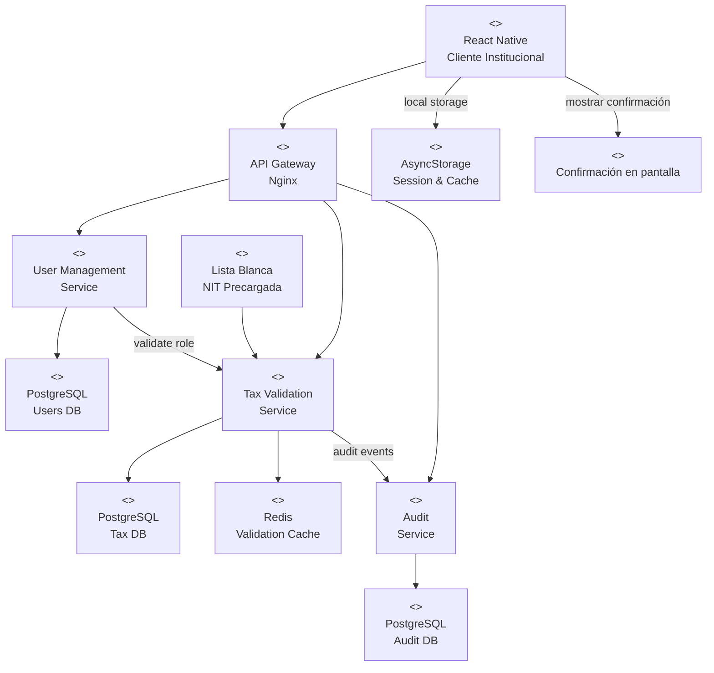
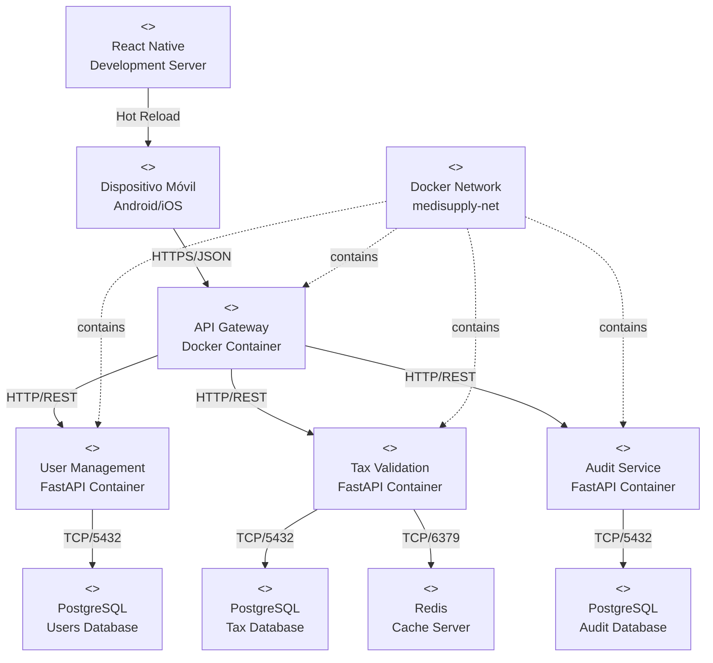
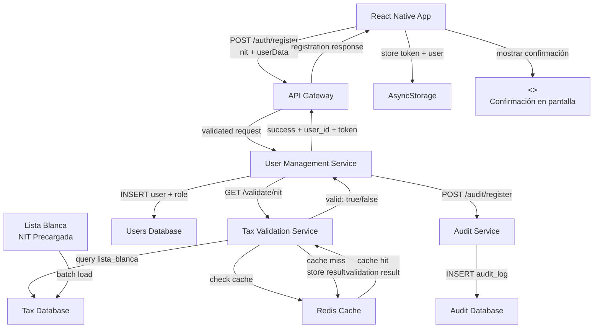
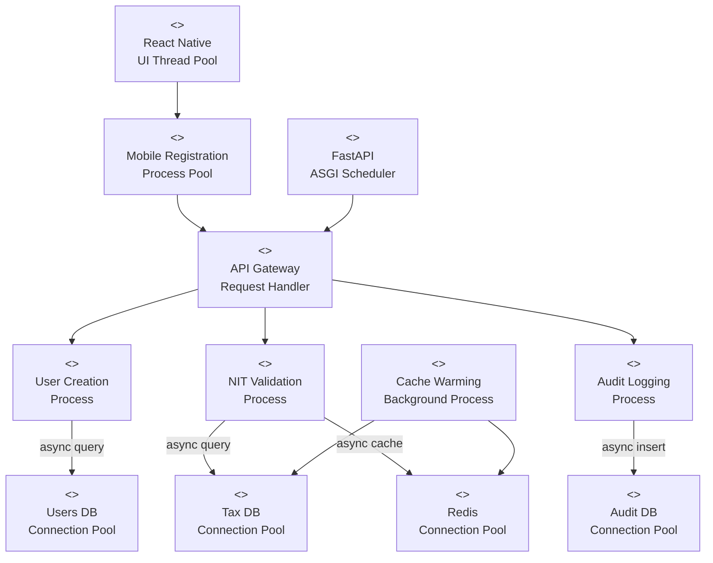

# Vistas Arquitectónicas - Experimento Registro Clientes Institucionales

---

# Vista Funcional – (Estilo Microservicios)

| Proyecto | Vista | ID | Elaboración | Modelo | Versión | Convención |
| --- | --- | --- | --- | --- | --- | --- |
| MediSupply | Funcional | VC-001 | Grupo 4 - Experimento React Native | Estilo Microservicios | 1.0 | Registro Clientes Móvil |

[Diagrama de arquitectura Vista Funcional]

---

# Vista Funcional – (Estilo Microservicios)

Justificaciones y Razonamiento del "Diagrama de arquitectura Vista Funcional"

## Tácticas de arquitectura utilizadas para favorecer la latencia

**Caché distribuido con Redis**: El Tax Validation Service utiliza Redis para cachear validaciones recientes de NIT, reduciendo consultas repetitivas a la base de datos y mejorando el tiempo de respuesta a <1 segundo.

**Almacenamiento local móvil**: React Native utiliza AsyncStorage para mantener caché local de validaciones y datos de sesión, permitiendo validación inmediata en casos de reconexión.

**API Gateway optimizado**: Implementación de rate limiting y enrutamiento eficiente para minimizar latencia de red entre aplicación móvil y microservicios.

## Razonamiento sobre las principales decisiones de arquitectura tomadas en este modelo

**Separación de responsabilidades por dominio**: Cada microservicio maneja una responsabilidad específica (gestión usuarios, validación tributaria, auditoría) permitiendo escalabilidad independiente y mantenimiento especializado.

**API Gateway como punto de entrada único**: Centraliza autenticación, autorización y enrutamiento, simplificando la integración desde React Native y proporcionando un punto de control de seguridad.

**Persistencia especializada**: PostgreSQL para datos transaccionales ACID (usuarios, auditoría), Redis para caché de alta velocidad, AsyncStorage para persistencia local móvil.

**Lista blanca precargada**: Los datos de NIT válidos se precargan en Tax Validation Service, eliminando dependencias externas en tiempo de validación y garantizando latencia predecible.

---

# Vista de despliegue

| Proyecto | Vista | ID | Elaboración | Modelo | Versión | Convención |
| --- | --- | --- | --- | --- | --- | --- |
| MediSupply | Despliegue | VC-002 | Grupo 4 - Experimento React Native | Despliegue Microservicios | 1.0 | Contenedores + Móvil |

[Diagrama de arquitectura Vista Despliegue]

---

# Vista de despliegue

Justificaciones y Razonamiento del "Diagrama de arquitectura Vista Despliegue"

## Tácticas de arquitectura utilizadas para favorecer la disponibilidad

**Contenedorización con Docker**: Cada microservicio se despliega en contenedores independientes, permitiendo aislamiento de fallos y recuperación rápida de servicios individuales.

**Red Docker interna**: Los microservicios se comunican a través de una red Docker privada, reduciendo latencia y proporcionando aislamiento de red para mayor seguridad.

**Separación de datos por servicio**: Cada base de datos PostgreSQL es independiente por microservicio, evitando puntos únicos de fallo en la persistencia.

## Razonamiento sobre las principales decisiones de arquitectura tomadas en este modelo

**Dispositivos móviles como clientes**: React Native se compila a aplicaciones nativas que se ejecutan directamente en dispositivos, proporcionando mejor performance y experiencia de usuario comparado con web móvil.

**API Gateway como proxy único**: Centraliza la gestión de certificados HTTPS, balanceeo de carga y políticas de seguridad, simplificando la configuración de red para la aplicación móvil.

**Desarrollo con Hot Reload**: El servidor de desarrollo React Native permite iteración rápida durante el experimento, crítico dado que el equipo no tiene experiencia previa.

**Persistencia distribuida**: Separación física de bases de datos permite optimización específica por tipo de datos (usuarios, validaciones tributarias, auditoría) y escalamiento independiente.

**Confirmación en-app**: La notificación de registro exitoso se muestra como mensaje en la UI móvil, eliminando dependencia de servicios de email externos y reduciendo la latencia de notificación.

---

# Vista de Información

| Proyecto | Vista | ID | Elaboración | Modelo | Versión | Convención |
| --- | --- | --- | --- | --- | --- | --- |
| MediSupply | Información | VC-003 | Grupo 4 - Experimento React Native | Flujo de Información | 1.0 | Datos Registro Cliente |

[Diagrama de arquitectura Vista de Información]

---

# Vista de Información

Justificaciones y Razonamiento del "Diagrama de arquitectura Vista Información"

## Tácticas de arquitectura utilizadas para favorecer la latencia

**Caché de validaciones**: Redis almacena resultados de validaciones de NIT recientes, evitando consultas repetitivas a PostgreSQL y reduciendo latencia de validación.

**Validación asíncrona**: Tax Validation Service puede responder inmediatamente desde caché mientras actualiza datos en background, manteniendo respuesta <1 segundo.

**Almacenamiento local**: AsyncStorage en React Native mantiene tokens y datos de usuario localmente, evitando validaciones redundantes en sesiones activas.

## Razonamiento sobre las principales decisiones de arquitectura tomadas en este modelo

**Flujo de validación centralizado**: Tax Validation Service actúa como autoridad única para validar NIT contra lista blanca, garantizando consistencia y auditabilidad.

**Token-based authentication**: JWT tokens permiten autenticación stateless entre móvil y microservicios, reduciendo overhead de sesiones de servidor.

**Auditoría de eventos críticos**: Registro de intentos de registro (exitosos y fallidos) en Audit Service proporciona trazabilidad requerida para cumplimiento de seguridad.

**Lista blanca precargada**: Datos de NIT válidos se cargan en startup del Tax Validation Service, eliminando dependencias externas durante validación en tiempo real.

**Confirmación en la app**: Tras recibir la respuesta de registro, la app muestra un mensaje de confirmación en pantalla para notificar al usuario de forma inmediata.

---

# Vista de Concurrencia

| Proyecto | Vista | ID | Elaboración | Modelo | Versión | Convención |
| --- | --- | --- | --- | --- | --- | --- |
| MediSupply | Concurrencia | VC-004 | Grupo 4 - Experimento React Native | Procesos Concurrentes | 1.0 | Registro Simultaneo |

[Diagrama de arquitectura Vista de Concurrencia]

---

# Vista de Concurrencia

Justificaciones y Razonamiento del "Diagrama de arquitectura Vista de Concurrencia"

## Tácticas de arquitectura utilizadas para favorecer la disponibilidad

**Pool de conexiones de base de datos**: Cada microservicio mantiene un pool de conexiones PostgreSQL, permitiendo manejo concurrente de múltiples solicitudes de registro sin bloqueos.

**Procesamiento asíncrono en FastAPI**: Uso de ASGI permite que cada microservicio maneje múltiples solicitudes concurrentemente sin bloquear threads.

**Cache warming en background**: Proceso separado mantiene Redis actualizado con validaciones frecuentes, asegurando disponibilidad de datos críticos.

## Razonamiento sobre las principales decisiones de arquitectura tomadas en este modelo

**Separación de procesos de validación**: NIT validation, user creation y audit logging ejecutan en paralelo cuando es posible, reduciendo tiempo total de registro.

**Thread pool en React Native**: Interfaz de usuario permanece responsiva mientras validaciones ejecutan en background threads.

**ASGI para concurrencia**: FastAPI con ASGI scheduler permite manejar alta concurrencia de solicitudes de registro sin overhead de threading tradicional.

**Background cache management**: Proceso independiente para warming de caché Redis evita que validaciones en tiempo real compitan por recursos de actualización de caché.

---

## Métricas de Validación del Experimento

- **Latencia objetivo**: <1 segundo para registro completo con validación de NIT.
- **Concurrencia objetivo**: 10 registros simultáneos sin degradación de performance.
- **Usabilidad objetivo**: Formulario completable en <30 segundos por usuario promedio.
- **Confirmación objetivo**: Pantalla de confirmación mostrada <1 segundo después de registro exitoso.
- **Seguridad objetivo**: 100% de registros con NIT inválido rechazados.
- **Disponibilidad objetivo**: 99% de solicitudes exitosas durante pruebas.

---

## Criterios de Éxito del Experimento

1. **Técnico**: React Native puede implementar el flujo completo de registro en <1 segundo
2. **Arquitectónico**: Microservicios responden adecuadamente a cargas concurrentes
3. **Usabilidad**: Interfaz intuitiva validada por usuarios no técnicos
4. **Seguridad**: Validación de lista blanca funciona 100% efectivamente
5. **Aprendizaje**: Equipo puede desarrollar funcionalidad adicional en React Native post-experimento
6. **Confirmación**: Usuario recibe confirmación desde la app inmediatamente después del registro exitoso

---

## Tabla de Códigos de Respuesta API REST (Registro de Clientes)

| Servicio | Endpoint | Método | Código | Significado | Manejo en App |
| --- | --- | --- | --- | --- | --- |
| User Management | POST /auth/register | POST | 200 OK | Registro exitoso | Mostrar confirmación en pantalla y navegar a inicio |
| User Management | POST /auth/register | POST | 400 Bad Request | Datos inválidos/incompletos | Resaltar campos con error y pedir corrección |
| User Management | POST /auth/register | POST | 401 Unauthorized | Credenciales/token inválido | Solicitar autenticación o reintentar inicio de sesión |
| User Management | POST /auth/register | POST | 409 Conflict | Institución ya registrada | Mostrar mensaje y ofrecer recuperación de credenciales |
| User Management | POST /auth/register | POST | 422 Unprocessable Entity | Validaciones de negocio fallidas | Mostrar mensajes específicos por campo |
| API Gateway | N/A (cualquier) | N/A | 429 Too Many Requests | Límite de peticiones excedido | Informar al usuario y reintentar con backoff |
| API Gateway | N/A (proxy) | N/A | 502/503/504 | Error/Timeout de servicio | Mostrar error temporal y reintentar |
| Tax Validation | GET /validate/nit?value= | GET | 200 OK | Validación exitosa (true/false) | Continuar si válido; si false, mostrar error NIT |
| Tax Validation | GET /validate/nit?value= | GET | 404 Not Found | NIT no está en lista blanca | Mostrar mensaje “NIT no autorizado” |
| Audit | POST /audit/register | POST | 200 OK | Evento auditado | Sin acción para el usuario |
| Audit | POST /audit/register | POST | 5xx | Error al auditar | No bloquear UI; log interno y reintento asíncrono |

Nota: La app debe mapear los códigos a mensajes de usuario consistentes y registrar métricas (p50/p95/p99) de latencia por endpoint para monitoreo.
